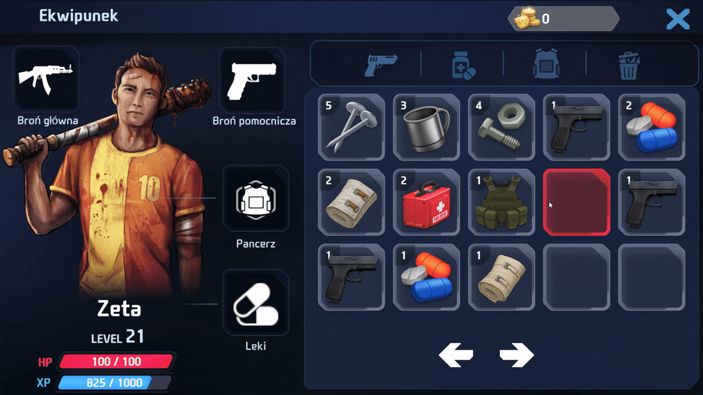
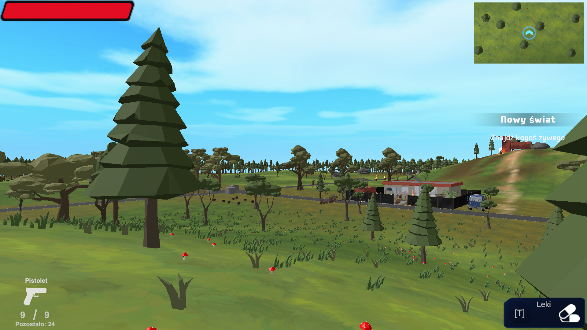
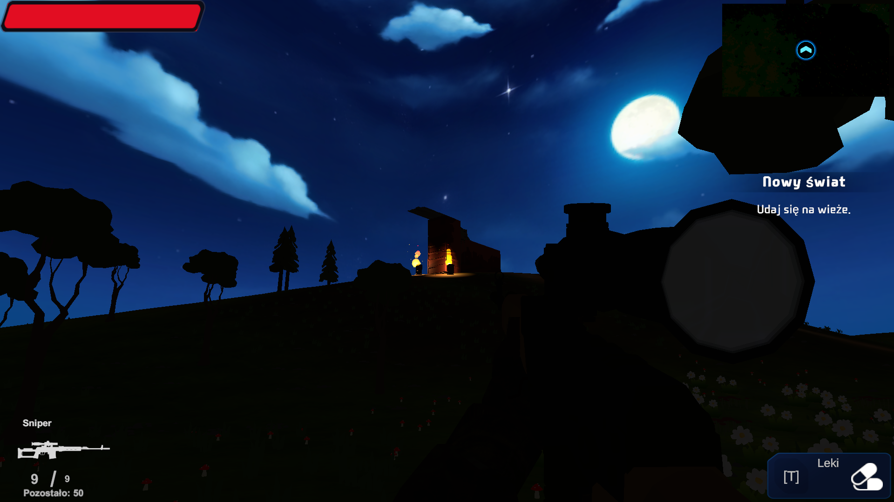

> **ℹInformacja o zawartości repozytorium**  
> Repozytorium zawiera **wyłącznie kod źródłowy gry** (skrypty C#, pliki konfiguracyjne, definicje obiektów).  
> **Nie zawiera** pełnych assetów (modele 3D, tekstury, dźwięki, animacje) ze względu na prawa autorskie i rozmiar plików.  
> Do uruchomienia projektu wymagane są własne lub zastępcze assety w odpowiednich folderach.

# Aphocalysa 3D — fragment FPS w świecie postapokaliptycznym

Krótki, grywalny wycinek gry FPS prezentujący kluczowe systemy: ekwipunek, dialogi z NPC, zadania, zachowania zombie oraz cykl dnia/nocy.  
Projekt zbudowany w **Unity 6000.0.8** z wykorzystaniem **URP**, **Entities (ECS)** oraz AI opartego o **NavMesh Agent**.

---

## Wymagania
- Unity 6000.0.8 (URP)
- Platforma docelowa: PC
- Input System: stary

---

## Najważniejsze funkcje

### Ekwipunek i przedmioty
- **Sortowanie typów:** Grupowanie i porządkowanie po kategoriach przedmiotów.
- **Sortowanie po wartości:** Implementacja **Quick Sort** do sortowania według wartości.
- **Drag & Drop:** Przeciąganie przedmiotów (broń, leki, pancerz) z ekwipunku na postać.
- **Integracja z pickupami:** Połączenie ekwipunku z systemem zbierania przedmiotów.
- **Integracja z UI:** Aktualizacja stanu ekwipunku i HUD‑u na żywo.
- **Zarządzanie bronią/amunicją:** Obsługa aktywnej broni i zapasu amunicji.

### Dialogi z NPC
- **Etapy rozmowy:** Sterowanie przebiegiem konwersacji (stage’y).
- **Integracja z questami:** Dialog wpływa na postęp zadań.
- **Warunki rozmowy:** Sprawdzanie, czy gracz może podjąć dialog.
- **Scriptable Objects:** Każdy dialog w osobnym pliku dla łatwiejszego zarządzania.

### Walka z zombie
- **Stany początkowe:** Stanie w miejscu, patrolowanie.
- **Zachowanie po wykryciu gracza:** Chód, pogoń poprzez **NavMesh Agent**.
- **Reakcja na dźwięki:** Hałaśliwe strzały przyciągają uwagę.
- **Sprawdzenie dystansu:** Atak tylko z odpowiedniej odległości.
- **Płynne animacje:** Przejścia sterowane parametrami Animatora.
- **Integracja z nawigacją:** Ruch zsynchronizowany z NavMesh.

### Świat i atmosfera
- **Cykl dnia i nocy:** Dynamiczna zmiana pory dnia.
- **URP:** Oświetlenie, cienie.

---

## Sterowanie
- **Ruch:** WASD  
- **Skok:** Space  
- **Strzał:** LPM  
- **Celowanie:** PPM  
- **Atak nożem:** F  
- **Interakcja:** E  
- **Ekwipunek:** I  
- **Panel zadań:** J  
- **Menu pauzy:** Esc  

---

## Media

### GIF — ekwipunek
Drag & Drop, sortowanie, zbieranie lootu  
  
  

### GIF — dialogi
Etapy rozmowy i wpływ na quest  

### GIF — walka z zombie
Patrol, pogoń, atak  

### Screeny — cykl dnia/nocy
  

---

## Technologie i architektura
- **Unity URP:** Rendering i oświetlenie.
- **Entities (ECS):** Optymalizacyjne wykorzystanie dla obiektów w oddali (niedostępne tło świata).
- **NavMesh Agent:** Nawigacja przeciwników.
- **Scriptable Objects:** Dialogi, definicje przedmiotów/questów.
- **Audio:** Mikser, suwaki głośności, mapowanie dB.

---

## Status
- **Obecnie:** Grywalny fragment z kluczowymi systemami.

---

## Znane kwestie
- **Wydajność cieni:** Duża liczba shadow casterów może wpływać na FPS; zalecane LOD/bake.
